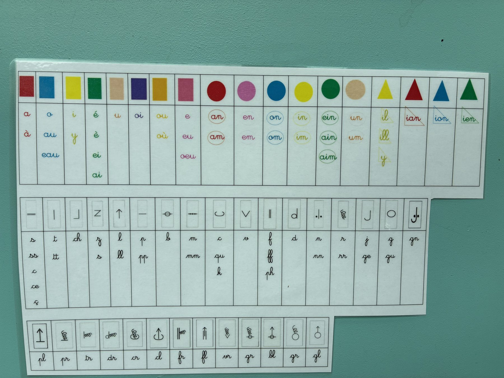

# Lire en couleurs — le code de lecture de la classe (méthode Aloé)

Un petit site, sans installation ni serveur, qui **transforme un texte en texte codé**
pour soutenir la lecture : une couleur par son-voyelle, les consonnes en noir,
les sons nasaux entourés, les sons avec yod dans un triangle, les lettres muettes soulignées.

Vous écrivez votre texte à gauche, il s'affiche codé à droite, prêt à être imprimé,
copié dans un traitement de texte ou exporté.



## Le code appliqué

| Signe | Sens |
|---|---|
| Couleur | Le son-voyelle : <span>a</span> rouge, <span>o</span> bleu, <span>i</span> jaune, <span>é/è</span> vert, <span>u</span> beige, <span>oi</span> violet, <span>ou</span> orange, <span>e/eu</span> rose |
| Noir | Les consonnes |
| Rond | Un son nasal, dans la couleur de sa voyelle : an, en, on, in, ein, un |
| Triangle | Un son avec yod : ill, ian, ion, ien |
| Trait simple | La lettre ne se dit pas (le *p* de sept, le *s* de quatre-vingts) |
| Double trait | La lettre fait le son [s] (cinq, six, dix, soixante, cent) |

La page [`tableau.html`](tableau.html) affiche tout le tableau, gestes des consonnes compris :
c'est exactement ce que le site applique au texte.

Les sources de référence sont dans [`docs/`](docs/) : la photo de l'affichage de classe
et les deux affichages de numération (nombres de 1 à 16, dizaines de 20 à 100).

## Utiliser le site

Ouvrez `index.html` **via un petit serveur** (les fichiers sont des modules JavaScript,
un double-clic sur le fichier ne suffit pas) :

```bash
python3 -m http.server 8000
# puis http://localhost:8000
```

Ou publiez-le tel quel sur GitHub Pages : *Settings → Pages → Deploy from a branch*,
branche `main`, dossier `/ (root)`. Le site est entièrement statique.

### Ce que propose la barre d'outils

- **Police, taille, interligne, espacement** — pour adapter à l'élève.
- **Couleurs** / **Couleurs foncées** — version noir et blanc, ou couleurs plus contrastées.
- **Gestes** — le geste de chaque consonne au-dessus de la lettre.
- **Muettes en gris** — les lettres muettes en gris en plus du trait.
- **Signaler les mots à vérifier** — pointillé orange sous les endroits où le découpage
  automatique est incertain.
- **Nombres en lettres** — « 17 » devient « dix-sept », codé comme le reste.
- **Copier** (texte en couleurs, collable dans un traitement de texte),
  **Exporter** (page web autonome), **Imprimer** (seule la feuille est imprimée).

### Corriger un mot

Le découpage est automatique, donc parfois faux. **Cliquez sur une lettre du texte codé**
pour choisir son code : son-voyelle, nasale, yod, consonne noire, lettre muette, lettre
qui fait [s]. La correction est enregistrée dans le navigateur et réappliquée chaque fois
que le mot revient. Le bouton *Mes corrections* les liste et permet de les retirer.

## Organisation des fichiers

```
index.html             l'application
tableau.html           le tableau des codes
assets/css/app.css     la mise en forme (écran + impression)
assets/js/data.js      les couleurs, les sons, les consonnes, le lexique des exceptions
assets/js/engine.js    le découpage du texte en graphèmes codés
assets/js/render.js    l'affichage (ronds, triangles, traits)
assets/js/gestures.js  les gestes des consonnes, en SVG
assets/js/numbers.js   les nombres écrits en lettres
assets/js/app.js       l'interface
tests/engine.test.mjs  les tests du découpage
```

## Enrichir le lexique

Les mots dont le code ne se déduit pas des règles sont dans `LEXICON` (`assets/js/data.js`).
Un mot = des groupes séparés par `|`, avec éventuellement `=` et la clé du son :

```js
'femme':    'f|e=a|mm|e=_',    // le e se lit [a], le e final est muet
'soixante': 's|oi|x=s2|an|t|e=_',  // le x fait [s] : double trait
```

Clés spéciales : `_` lettre muette, `s2` lettre qui fait [s], `z` lettre qui fait [z],
`noir` consonne sans code. Les autres clés sont celles de `SOUNDS` et `CONSONANTS`.

## Tests

```bash
node tests/engine.test.mjs
```

Les tests vérifient une soixantaine de mots représentatifs, l'alignement de chaque entrée
du lexique avec les lettres du mot, et le fait qu'aucun caractère du texte n'est perdu.

## Limites connues

Le français ne se code pas entièrement par règles. Les cas suivants restent approximatifs,
d'où le bouton de correction manuelle :

- **`-ent` final après une consonne** : « ils chantent » (muet) ou « un moment » ([an]) ?
  Le site garde la nasale par défaut et connaît une trentaine de formes verbales courantes.
- **`ill`** : [ij] (fille) ou [il] (ville) ? Le site code [ij] sauf pour les mots du lexique.
- **`y` entre deux voyelles** : codé comme un son avec yod (ay, oy, uy), ce qui dépasse
  l'affichage de la classe mais évite de laisser la lettre sans code.
- **`oin`, `ay`, `oy`, `uy`** ne figurent pas sur l'affichage de classe : ils ont été
  ajoutés, repérés par une étoile dans le tableau.
- Les mots rares, les noms propres et les mots étrangers sont codés comme du français.
